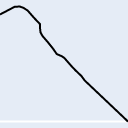
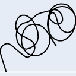
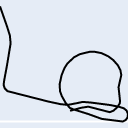
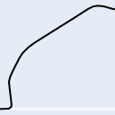
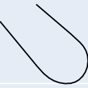

# Intro

## Download the Repo
### Requirements 
 - [Jupyter](https://jupyter.org/install)
 
### Installing & Running
The following code will download this repo and open it in Jupyter so you can follow along and execute the code.
```bash
git clone https://github.com/bmswens/Maneuver-ID-Introduction-Notebook.git
cd Maneuver-ID-Introduction-Notebook
pip install notebook
jupyter notebook 'Maneuver ID Introduction Notebook.ipynb'
```

## Website
https://maneuver-id.mit.edu/
## About
The U.S. Air Force released a dataset from Pilot Training Next (PTN) through the AI Accelerator of Air Force pilots and trainees flying in virtual reality simulators. In an effort to enable AI coaching and automatic maneuver grading in pilot training, the Air Force seeks to automatically identify and label each maneuver flown in this dataset from a catalog of around 30 maneuvers. Your solution helps advance the state of the art in flying training!
## The Challenge(s)

1. Sorting "useful" vs "non-useful" data
2. Separating "useful" data
3. Identifying Maneuvers
4. Grading Maneuvers

## Maneuvers
There are 18 maneuvers, but many have sub-classes, for a total of 29 maneuvers, listed below:


```python
maneuvers = [
    'UndershootingTPStall', # undershooting traffic pattern stall
    'AileronRoll',
    '60SteepTurn', # turn performed at 60 deg bank
    'BarrelRoll',
    'SplitS',
    'ILS', # Instrument landing system aproach
    'StraightIn',
    'OverheadPattern',
    'ClosedPullup',
    'ELP-PEL', # Emergency landing pattern, precautionary emergency landing
    'Cuban8',
    'UnusualAttitudeNoseHigh',
    'Loop',
    'NoseLowRecovery',
    'VerticalSalpha',
    'VerticalSbravo',
    'UnusualAttitudeNoseLow',
    'IntentionalSpin',
    'SlowFlight',
    'Immelman',
    'Lazy8',
    'NoseHighRecovery',
    'PowerOnStallNoseLowTurning',
    'ELP-FL', # Emergency landing pattern, forced landing
    'LandingAttitudeTPStall', # landing traffic pattern stall
    '45SteepTurn', # turn performed at 45 deg bank
    'OvershootingTPStall', # overshooting traffic pattern stall
    'Localizer',
    'PowerOnStallNoseHighTurning'
]
```

More information on some of these maneuvers can be found here: http://maneuver-id.mit.edu/maneuvers-0

# Data

## Meta
Data is stored in .tsv format with the following headers and data types:


```python
headers = {
    "": int, # one up numbering system
    "time (sec)": float,
    "xEast (m)": float,
    "yNorth (m)": float,
    "zUp (m)": float,
    "vx (m/s)": float,
    "xy (m/s)": float,
    "vz (m/s)": float,
    "head (deg)": float,
    "pitch (deg)": float,
    "roll (deg)": float
}
```

## Loading
Python provides the built-in `csv` module that we can use to import .tsv files.

---
**Caveat**

The files may sometimes contained malformed rows which don't cast to the data type they're supposed to. In this tutorial we will skip those rows with the assumption that the overall track will still provide an intelligible track.

This behavior can be modified in the `clean_row` function.

---


```python
import csv


def clean_row(row):
    """
    This function is used to determine if a row should get added to the dataset.
    If this function returns a "truthy" value, the clean function will append the returned value.
    Else if it returns a "falsey" value, it will skip the row.
    
    Inputs:
    row -- The input row as a dictionary
    
    Outputs:
    output -- Either:
        A. The cleaned version of the input row, as a dictionary
        B. A "falsey" value
    """
    output = {}
    for header in row:
        value = row[header]
        try:
            output[header] = float(value)
        except:
            return False
    return output
        

def load(path):
    """
    This function takes in a file path and returns the content as a list of dictionaries.
    
    Inputs:
    path -- path to the .tsv file on the disk
    
    Outputs:
    output -- list of dictionaries
    """
    output = []
    with open(path) as incoming:
        reader = csv.DictReader(incoming, delimiter='\t')
        for row in reader:
            cleaned_row = clean_row(row)
            if cleaned_row:
                output.append(cleaned_row)
    return output
```


```python
data = load('flights/example.tsv')
print(data[0])
```

    {'': 0.0, 'time (sec)': 0.0, 'xEast (m)': 42.530525, 'yNorth (m)': -71.25009, 'zUp (m)': 2121.2415, 'vx (m/s)': 0.0, 'vy (m/s)': 0.0, 'vz (m/s)': 0.0, 'head (deg)': 33.41844, 'pitch (deg)': -2.4562333, 'roll (deg)': 0.72901607}


## Visualizing

Visualization is an important part of enabling the human portion of human-machine teaming. It allows us to quickly understand the data, and perhaps even verify that our models are on the right path.

In this notebook, we'll use [Ploty](https://plotly.com/python/) for interactive visualizations, but [Matplotlib](https://matplotlib.org/) is another common library, especially in the scientific community.


```python
%%capture
# Install a pip package in the current Jupyter kernel
import sys
!{sys.executable} -m pip install plotly
!{sys.executable} -m pip install chart_studio
!{sys.executable} -m pip install kaleido

import plotly.graph_objects as go
import plotly.offline as offline

def visualize_3D(
    data,
    x_field="xEast (m)",
    y_field="yNorth (m)",
    z_field="zUp (m)",
    path=None
):
    """
    Plots the data to an interactive 3D graph. Saves the graph to a file if path is provided.
    
    Inputs:
    data -- List: A list of dictionaries containing the data to plot
    x_field -- String: The name of the key for X data
    y_field -- String: The name of the key for Y data
    z_field -- String: The name of the key for Z data
    path -- String: The path to save the file to on disk.
    
    Outputs:
    None
    """
    x = [row[x_field] for row in data]
    y = [row[y_field] for row in data]
    z = [row[z_field] for row in data]
    plot = go.Scatter3d(
        x=x, 
        y=y, 
        z=z,
        marker=dict(
            size=2,
            color="black"
        ),
        line=dict(
            color='black',
            width=2
        )
    )
    fig = go.Figure(data=plot)
    fig.update_layout(
        autosize=True,
        scene=dict(
            camera=dict(
                up=dict(
                    x=0,
                    y=0,
                    z=1
                ),
                eye=dict(
                    x=0,
                    y=1.0707,
                    z=1,
                )
            ),
            aspectratio = dict( x=1, y=1, z=0.7 ),
            aspectmode = 'manual'
        ),
    )
    if path:
        if ".png" in path:
            fig.write_image(path)
        else:
            fig.write_html(path)
    fig.show()
    

def visualize_2D(data, y_field, x_field=None, path=None):
    """
    Plots the data to an interactive 2d graph. Saves the graph to a file if path is provided.
    
    Inputs:
    data -- List: A list of dictionaries containing the data to plot
    x_field -- String: The name of the key for X data, defaults to index of Y field
    y_field -- String: The name of the key for Y data
    path -- String: The path to save the file to on disk.
    
    Outputs:
    None
    """
    y = [row[y_field] for row in data]
    if x_field:
        x = [row[x_field] for row in data]
    else:
        x = [index for index, _ in enumerate(y)]
    plot = go.Scatter(
        x=x, 
        y=y,
        marker=dict(
            size=2,
            color="black"
        ),
        line=dict(
            color='black',
            width=2
        )
    )
    fig = go.Figure(data=plot)
    fig.update_layout(
        autosize=True,
        scene=dict(
            camera=dict(
                up=dict(
                    x=0,
                    y=0,
                    z=1
                ),
                eye=dict(
                    x=0,
                    y=1.0707,
                    z=1,
                )
            ),
            aspectratio = dict( x=1, y=1, z=0.7 ),
            aspectmode = 'manual'
        ),
    )
    if path:
        if ".png" in path:
            fig.write_image(path)
        else:
            fig.write_html(path)
    fig.show()
```


```python
visualize_3D(data)
```

```python
visualize_2D(data, "zUp (m)")
```

## Understanding The Data

---

**Caveat**

The flight simulator that provided this data has some unique functions to it that are normally not possible in regular flight.
* Pilots can teleport the plane from the runway into the air
* Pilots can "snap" the plane to headings, pitches, and roles that would normally be too large of a change

---

### Time
Units: Seconds

This column is the number of seconds since the flight began, often in intervals of roughly 0.1 seconds.
### xEast, yNorth, zUp
Units: Meters

These columns plot where the plane is at a given point in time and can be thought of similiar to lattiude, longitude, and altitude.
### vx, vy, vz
Units: Meters per second

Stands for: Velocity in the given axis.

These columns denote the current speed of the aircraft in a given axis.
### Head
Units: Degrees

This will help indicate the direction that the aircraft is flying in. Combined with a non-zero velocity, this field can be used to calculate where the next data point would be (xEast and yNorth).
### Pitch
Units: Degrees

This will help indicate if an aircraft is ascending or descending. Combined with a non-zero veloicty, can be used to calcluate the zUp of the next data point.
### Roll
Units: Degrees

Indicates the orientation of the aircraft. 0 is what we would generally relate with "right side up" and 180 would be "upside down."

---

The following image can be used to help understand head (heading), pitch, and roll.

---


# Preprocessing / Data Wrangling
Preprocessing your data can sometimes be just as important as the actual model architecture itself.

Below are some examples of preprocessing that could be done to the data. Not all will necessarily provide an impact, and some may even have negative results. These are just to provide examples. 

## Remove Runway Data
In this process we aim to (naively) remove datapoints that occur on or near the runway.

Reasoning: A pilot is hopefully not performing maneuvers near the ground or runway, as that would be dangerous.


```python
def remove_runway_data(data, minimum=100):
    output = []
    for row in data:
        if row["zUp (m)"] >= minimum:
            output.append(row)
    return output
```

## Calculate Airspeed
In this process, we're going to remove the independent `vx (m/s)` and `vy (m/s)` fields, and add them into a single field, then remove the two fields used to calculate it.

Reason: The written parameters of what define a good maneuver vs a bad maneuver take airspeed into account. As humans, we often don't care about whether an aircraft is going North at 10 m/s and East at 2 m/s, we care more tha they are going 12 m/s with heading of 45 degrees. Perhaps the model may perform better to have the data the same way? 


```python
def calculate_airspeed(data):
    output = []
    for row in data:
        vx = row["vx (m/s)"]
        vy = row["vy (m/s)"]
        velocity = ((vx ** 2) + (vy ** 2)) ** 0.5
        # add vy as well?
        # I don't know physics
        row.pop("vx (m/s)", None)
        row.pop("vy (m/s)", None)
        row["airspeed"] = velocity
        output.append(row)
    return output
```

# Making A Model
Now we'll write a convolutional neural network (CNN) based on graphs of the `xEast` and `yNorth` fields (it will visualize as though we were looking at the flight path from a top-down perspective) to see if it can classify the flights in accordance with the labled data.

---

**Caveat**

In order to accomplish this part of the notebook, you will have have to have access to the dataset.

---


```python
# change these based on your file paths
train_path = "flights/labeled/train"
test_path = "flights/labeled/test"

# precentage of training data to use as training vs validation
train_percentage = 0.75
```

## Making a Dataset
Our dataset is going to be based off of the PNG representation of the flight, from a top down perspective.

Images will be saved to `{path}_img` folder.

You can modify this `Dataset` class to fit your needs.


```python
%%capture
# Install a pip package in the current Jupyter kernel
import sys
!{sys.executable} -m pip install torch torchvision
```


```python
# built in
import os
import csv
# 3rd party
import torch
import torchvision
from PIL import Image
import numpy as np

class FlightsAsImageDataset(torch.utils.data.Dataset):
    """
    This class will load and convert all flights to graphs as a .png
    The graphs are based on 'xEast' and 'yNorth' and represent a top-down view of the flight.
    
    Params:
    size - the height and width of the output .png
    make - whether or not to generate the image (false allows you to skip making the image if it already exists)
    """
    def __init__(self, path, size=128, make=True):
        self.all_labels = [folder for folder in os.listdir(path) if 'img' not in folder]
        self.images = []
        self.labels = []
        self.size = size
        for label in self.all_labels:
            for f in os.listdir(os.path.join(path, label)):
                if f.startswith('.') or '.tsv' not in f:
                    continue
                new_path = self.convert_to_png(os.path.join(path, label, f), make)
                self.images.append(new_path)
                self.labels.append(label)
            
    def __len__(self):
        return len(self.images)
    
    def __getitem__(self, idx):
        path = self.images[idx]
        img = Image.open(path).convert('RGB')
        array = np.array(img)
        label = self.labels[idx]
        if label == "good":
            label = 1
        else:
            label = 0
        label = torch.tensor(label, dtype=torch.float32)
        tensor = torchvision.transforms.ToTensor()(img)
        # tensor = tensor.unsqueeze(0)
        return tensor, label
    
    def convert_to_png(self, full_path, make):
        
        # flights/good_train/01.tsv -> flights/good_train_img/01.png
        file_name = os.path.basename(full_path)
        file_name = file_name.replace('.tsv', '.png')
        
        folder = os.path.dirname(full_path)
        folder += '_img'
        
        os.makedirs(folder, exist_ok=True)
        
        new_path = os.path.join(folder, file_name)
        
        if make:
            data = self.load(full_path)

            y = [row["yNorth (m)"] for row in data]
            x = [row["xEast (m)"] for row in data]
            plot = go.Scatter(
                x=x, 
                y=y,
                marker=dict(
                    size=2,
                    color="black"
                ),
                line=dict(
                    color='black',
                    width=2
                )
            )
            fig = go.Figure(data=plot)
            fig.update_layout(
                margin=go.layout.Margin(
                    l=0, #left margin
                    r=0, #right margin
                    b=0, #bottom margin
                    t=0, #top margin
                ),
                height=self.size,
                width=self.size,
                scene=dict(
                    camera=dict(
                        up=dict(
                            x=0,
                            y=0,
                            z=1
                        ),
                        eye=dict(
                            x=0,
                            y=1.0707,
                            z=1,
                        )
                    ),
                    aspectratio = dict( x=1, y=1, z=0.7 ),
                    aspectmode = 'manual'
                ),
            )
            fig.update_xaxes(showticklabels=False, showgrid=False)
            fig.update_yaxes(showticklabels=False, showgrid=False)
            fig.write_image(new_path)
        return new_path
    
    @staticmethod
    def clean_row(row):
        output = {}
        for header in row:
            value = row[header]
            try:
                output[header.strip()] = float(value)
            except:
                return False
        return output
        
    def load(self, full_path):
        output = []
        with open(full_path) as incoming:
            reader = csv.DictReader(incoming, delimiter='\t')
            for row in reader:
                cleaned_row = self.clean_row(row)
                if cleaned_row:
                    output.append(cleaned_row)
        return output
        
```


```python
# load our datasets
train_data = FlightsAsImageDataset(train_path)
test_data = FlightsAsImageDataset(test_path)

# split training data into training and validation
train_size = int(len(train_data) * train_percentage)
val_size = len(train_data) - train_size
train_data, val_data = torch.utils.data.random_split(train_data, [train_size, val_size], generator=torch.Generator().manual_seed(42))
```


```python
# send the datasets into data loaders
train_data_loader = torch.utils.data.DataLoader(
    train_data,
    batch_size=1,
    num_workers=4
)
val_data_loader = torch.utils.data.DataLoader(
    val_data,
    batch_size=1,
    num_workers=4
)
test_data_loader = torch.utils.data.DataLoader(
    test_data,
    batch_size=1,
    num_workers=4
)
```

## Building The Model
Here we'll build a CNN to train on our dataset.


```python
# 3rd party
from torch import nn

class CNN(nn.Module):
    """
    A basic convolutional neural network
    """
    def __init__(self):
        
        super(CNN, self).__init__()
        
        # reused
        self.pool = nn.MaxPool2d(2, 2)
        self.flatten = torch.flatten
        self.relu = nn.ReLU()
        
        # layer one
        self.conv1 = nn.Conv2d(3, 6, 5)
        
        # layer two
        self.conv2 = nn.Conv2d(6, 12, 5)
        
        # connected layers
        self.linear1 = nn.Linear(10092, 512)
        self.linear2 = nn.Linear(512, 128)
        self.linear3 = nn.Linear(128, 1)
        
        

    def forward(self, x):
        # first set of layers
        x = self.conv1(x)
        x = self.relu(x)
        x = self.pool(x)
        
        # second set of layers
        x = self.conv2(x)
        x = self.relu(x)
        x = self.pool(x)
        
        # connected
        x = torch.flatten(x)
        x = self.linear1(x)
        x = self.relu(x)
        
        x = self.linear2(x)
        x = self.relu(x)
        
        x = self.linear3(x)
        
        return x
        

```


```python
device = 'cuda' if torch.cuda.is_available() else 'cpu'
print(f'Using {device} device')
model = CNN().to(device)
```

    Using cpu device


    /home/bmswens/projects/maneuver/venv/lib/python3.8/site-packages/torch/cuda/__init__.py:80: UserWarning:
    
    CUDA initialization: Unexpected error from cudaGetDeviceCount(). Did you run some cuda functions before calling NumCudaDevices() that might have already set an error? Error 803: system has unsupported display driver / cuda driver combination (Triggered internally at  ../c10/cuda/CUDAFunctions.cpp:112.)
    


## Training the Model
Here we'll do 5 passes at training the model, saving the best models.


```python
epochs = 5
learning_rate = 0.01

loss = nn.MSELoss()
optimizer = torch.optim.SGD(model.parameters(), lr=learning_rate)
```


```python
# training loop

def train_one_epoch(model, data, loss, optimizer):
    total_loss = 0.
    model.train()
    i = 0
    for img, label in data:
        pred_label = model(img)
        l = loss(pred_label, label)
        l.backward()
        optimizer.step()
        optimizer.zero_grad()
        total_loss += l.item()
        i += 1
        if i % 500 == 0:
            print(f'train: img {i} avg loss - {total_loss / i}')
    return total_loss / len(data)


def test_one_epoch(model, data, loss):
    total_loss = 0.
    model.eval()
    i = 0
    for img, label in data:
        pred_label = model(img)
        l = loss(pred_label, label)
        total_loss += l.item()
        i += 1
        if i % 100 == 0:
            print(f'validate: img {i} avg loss - {total_loss / i}')
    return total_loss / len(data)
    
best_loss = None
print(f'training size - {len(train_data_loader)} validate size - {len(val_data_loader)}')
for epoch in range(epochs):
    train_loss = train_one_epoch(model, train_data_loader, loss, optimizer)
    val_loss = test_one_epoch(model, val_data_loader, loss)
    print(f'{epoch + 1}: train - {train_loss:.7f} test - {val_loss:.7f}')
    if best_loss is None or val_loss < best_loss:
        best_loss = val_loss
        model_path = f'model_{epoch}'
        torch.save(model.state_dict(), model_path)
    
```

    training size - 2935 validate size - 979
    train: img 500 avg loss - 0.1610879462584859
    train: img 1000 avg loss - 0.1473650157843877
    train: img 1500 avg loss - 0.1321438638652614
    train: img 2000 avg loss - 0.11630468241105475
    train: img 2500 avg loss - 0.10086777892563366
    validate: img 100 avg loss - 0.05271123993641595
    validate: img 200 avg loss - 0.04185919461997514
    validate: img 300 avg loss - 0.05003007213800099
    validate: img 400 avg loss - 0.049478260602186346
    validate: img 500 avg loss - 0.053521229020724176
    validate: img 600 avg loss - 0.050805241573015136
    validate: img 700 avg loss - 0.04572110537580593
    validate: img 800 avg loss - 0.04368920098777597
    validate: img 900 avg loss - 0.04087536544890393
    1: train - 0.0920245 test - 0.0403670
    train: img 500 avg loss - 0.04094413744596614
    train: img 1000 avg loss - 0.041896632919077546
    train: img 1500 avg loss - 0.03572727851124847
    train: img 2000 avg loss - 0.03242997052739174
    train: img 2500 avg loss - 0.029213906702548486
    validate: img 100 avg loss - 0.023646147914141692
    validate: img 200 avg loss - 0.014901574669430602
    validate: img 300 avg loss - 0.02466770669749778
    validate: img 400 avg loss - 0.026368214469020507
    validate: img 500 avg loss - 0.02691270500239139
    validate: img 600 avg loss - 0.026551345750967573
    validate: img 700 avg loss - 0.02416707770479375
    validate: img 800 avg loss - 0.024727862949507157
    validate: img 900 avg loss - 0.02386166186093168
    2: train - 0.0283736 test - 0.0242293
    train: img 500 avg loss - 0.020608065610615227
    train: img 1000 avg loss - 0.02295265936539708
    train: img 1500 avg loss - 0.02059355291438041
    train: img 2000 avg loss - 0.020236656122642308
    train: img 2500 avg loss - 0.017793905352724005
    validate: img 100 avg loss - 0.020294105415854916
    validate: img 200 avg loss - 0.013410878491120002
    validate: img 300 avg loss - 0.02209369460235242
    validate: img 400 avg loss - 0.025433750006424703
    validate: img 500 avg loss - 0.02572440055767936
    validate: img 600 avg loss - 0.025008579164366176
    validate: img 700 avg loss - 0.023135793536295433
    validate: img 800 avg loss - 0.024407259905868593
    validate: img 900 avg loss - 0.024235052702747357
    3: train - 0.0178936 test - 0.0251238
    train: img 500 avg loss - 0.01705633786671507
    train: img 1000 avg loss - 0.018637962121559628
    train: img 1500 avg loss - 0.016067404153733107
    train: img 2000 avg loss - 0.016045398462488068
    train: img 2500 avg loss - 0.014322437831524605
    validate: img 100 avg loss - 0.025139674501580344
    validate: img 200 avg loss - 0.01818832628512027
    validate: img 300 avg loss - 0.02454630846554219
    validate: img 400 avg loss - 0.029022138410966358
    validate: img 500 avg loss - 0.02922104328243816
    validate: img 600 avg loss - 0.02790349241597923
    validate: img 700 avg loss - 0.02638719201142753
    validate: img 800 avg loss - 0.028200261720735663
    validate: img 900 avg loss - 0.028277914156278443
    4: train - 0.0144964 test - 0.0294591
    train: img 500 avg loss - 0.015480758445218847
    train: img 1000 avg loss - 0.015520363018694089
    train: img 1500 avg loss - 0.013495748982609364
    train: img 2000 avg loss - 0.014587328371613237
    train: img 2500 avg loss - 0.012562898963736023
    validate: img 100 avg loss - 0.02309733682252954
    validate: img 200 avg loss - 0.016781536905027962
    validate: img 300 avg loss - 0.02279275063795088
    validate: img 400 avg loss - 0.02784332210013421
    validate: img 500 avg loss - 0.02777815631891795
    validate: img 600 avg loss - 0.026081987603950103
    validate: img 700 avg loss - 0.024673262871166283
    validate: img 800 avg loss - 0.026459716090367083
    validate: img 900 avg loss - 0.026838226403563634
    5: train - 0.0126232 test - 0.0279059


## Checking the Model
Next we'll check the overall accuracy of the model on our testing data.


```python
correct = 0
for img, label in test_data_loader:
    model.eval()
    pred = model(img)
    rounded_pred = round(pred.item())
    if rounded_pred == label:
        correct += 1
print(f'{(correct / len(test_data_loader)) * 100:.4f}% correct')
```

    95.2641% correct


Now we'll load up 5 random flights and see how our model did.


```python
from IPython.display import Image as PyImage
import random

for _ in range(5):
    index = random.randint(0, len(test_data) - 1)
    path = test_data.images[index]
    img, label = test_data[index]
    predicted = model(img.unsqueeze(0))
    display(PyImage(filename=path))
    print(f'Predicted: {round(predicted.item())}; Actual: {label}')
    
```


    

    


    Predicted: 1; Actual: 1.0


    

    


    Predicted: 1; Actual: 1.0


    

    


    Predicted: 1; Actual: 1.0


    

    


    Predicted: 1; Actual: 1.0


    

    


    Predicted: 1; Actual: 1.0


# The End
After this, you should now have all the resources necessary to start tweaking the model, or dataset, or both to produce a higher degree of accuracy.

Listed below are a few ideas to get your started.

## Ideas
- Change the size of the images (512x512 is slower but increases to ~96% accuracy)
- Create a deeper CNN
- Add the altitude over time as another layer to the CNN
- Modify the dataset to instead analyze the underlying data
- Apply transformations (such as rotation or cropping) to the images

## Contributors
 - [Brandon Swenson](https://github.com/bmswens) - Author
 - Jonathan Hurrell - Feedback
 - Kyle McAplin - Feedback
 - Armando Cabrera - Feedback

## Acknowledgment
If you would like to acknowledge this notebook in your paper or report, we recommend the following:

> The authors acknowledge the Maneuver ID Introduction Notebook for providing learning resources that have contributed to the research results reported within this paper/report.

Thank you for acknowledging us – we appreciate it.
